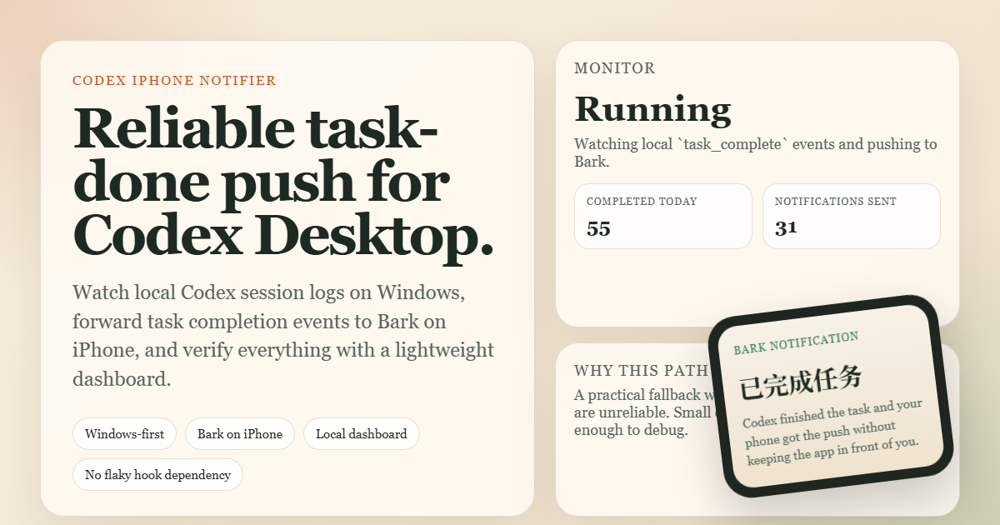
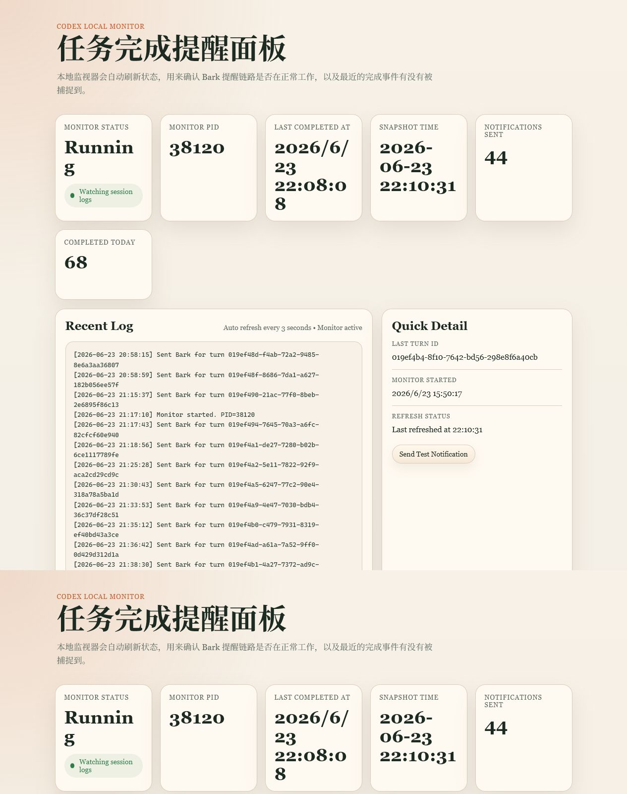
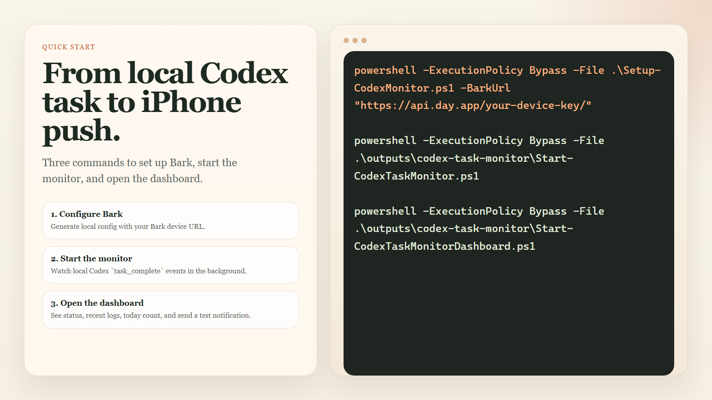

# Codex iPhone Notifier

Reliable iPhone notifications for Codex Desktop on Windows.

This project watches local Codex session logs, detects `task_complete` events, and forwards them to Bark on iPhone. It also includes a desktop GUI and local dashboard so you can inspect monitor state, recent logs, and send a test notification without touching Codex internals.

## Preview



Desktop monitor and dashboard preview:



Quick setup flow:



## Why this exists

Codex Desktop notification and hook behavior can be inconsistent across real Windows setups. This project avoids that path entirely and instead watches local `~/.codex/sessions` activity directly.

If you want Codex to finish a task and quietly ping your phone, this is the practical Windows-first path.

## What it does

- Watches `~/.codex/sessions` for new `task_complete` events
- Sends Bark push notifications to iPhone
- Runs a local monitor and optional local dashboard
- Includes a Windows desktop GUI for daily use
- Supports test notifications, diagnostics, startup install, and local status recovery

## Recommended way to use it

If you just want the desktop app:

1. Download the release package.
2. Extract it.
3. Run `CodexMonitorGui.exe`.
4. Paste your Bark URL into the GUI and save.

Recommended release asset:

- `CodexMonitorGui-ps2exe-win64.zip`

## Quick start from source

1. Install Bark on iPhone and copy your device URL.
2. Run:

```powershell
powershell -ExecutionPolicy Bypass -File .\Setup-CodexMonitor.ps1 -BarkUrl "https://api.day.app/your-device-key/"
```

3. Run a local health check:

```powershell
powershell -ExecutionPolicy Bypass -File .\Test-CodexMonitor.ps1 -SendNotification -StartDashboard
```

4. Start the monitor:

```powershell
powershell -ExecutionPolicy Bypass -File .\CodexMonitor.ps1 -Action start
```

5. Open the dashboard:

```powershell
powershell -ExecutionPolicy Bypass -File .\CodexMonitor.ps1 -Action open
```

## Desktop GUI

The repository also includes a WPF-based desktop GUI with:

- Monitor and dashboard start/stop/restart controls
- Bark URL and dashboard port settings
- Recent log view
- Error and diagnostic summaries
- Startup toggle
- Tray behavior
- Local cleanup and rebuild action

For the current Windows packaging pass, the most practical GUI build is the `ps2exe` release in `dist/CodexMonitorGui-ps2exe/`.
For GitHub releases, ship the packaged archive asset rather than committing local `dist/` output.
The GUI is intended to be the default day-to-day entry point for this project on Windows.

## Project layout

- `outputs/bark-notify`: Bark sender script and Bark config
- `outputs/codex-task-monitor`: background monitor, dashboard, and monitor state files
- `outputs/ntfy-notify`: older `ntfy` path kept as reference
- `locales/`: GUI language files
- `docs/`: architecture notes, release notes, and preview assets

## Useful scripts

- `Setup-CodexMonitor.ps1`: generate local config files
- `Test-CodexMonitor.ps1`: run a local health check
- `Install-CodexMonitorStartup.ps1`: install Windows logon startup
- `Uninstall-CodexMonitorStartup.ps1`: remove Windows logon startup
- `Restore-CodexMonitorWindow.ps1`: pull the GUI window back to the foreground if needed

## Notes

- This is currently optimized for Windows-first practical use.
- Bark is the default iPhone path because it proved more reliable than `ntfy` on this setup.
- The runtime layout still uses `outputs/` to avoid breaking a known-good working local setup during the first public release.
- Release packages should contain only template config and no local Bark URL, PID, log, or state files.

Architecture notes live in [docs/architecture.md](/C:/Users/ASD/Documents/Codex/2026-06-23/you/docs/architecture.md).

## License

MIT
